# Rent Finder

Xây dựng ứng dụng NFT theo trào lưu Move-to-Earn.

## Nội dung

1. [Chức năng](#Chức-năng)
   1. [Đăng nhập, Đăng ký](#Đăng-nhập-Đăng-ký)
   2. [Tái tạo năng lượng, chọn giày để chạy](#Tái-tạo-năng-lượng-chạy)
   3. [Quản lý kho giày sở hữu](#Quản-lý-kho-giày)
   4. [Quản lý ví ảo](#Quản-lý-ví-ảo)
   5. [Quản lý hồ sơ người dùng](#Quản-lý-hồ-sơ)
   6. [Hoạt động chạy kiếm tiền](#-Hoạt-động-chạy-kiếm-tiền)
   7. [Phát hiện gian lận GPS](#-Phát-hiện-gian-lận)

2. [Yêu cầu thiết bị](#Yêu-cầu-thiết-bị)
3. [Thư viện và công nghệ](#Thư-viện-và-công-nghệ)
4. [Tác giả](#Tác-giả)
5. [Giấy phép](#Giấy-phép)

## Chức năng

### Đăng nhập, Đăng ký

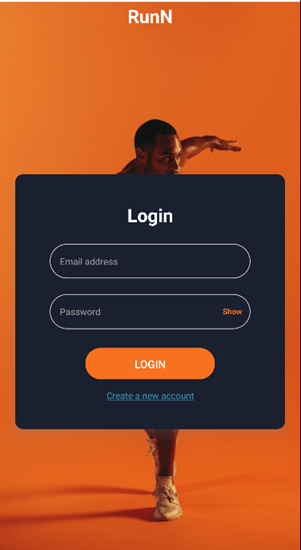 

### Tái tạo năng lượng chạy

  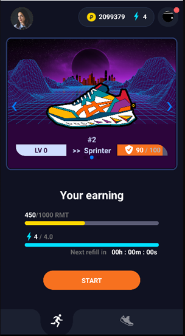  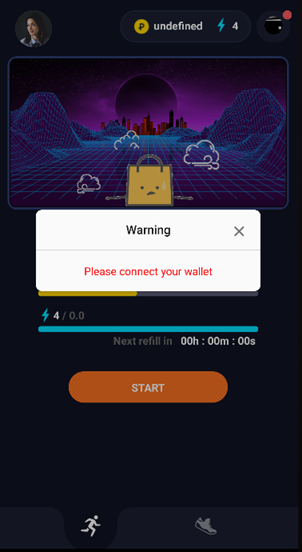

### Quản lý kho giày

  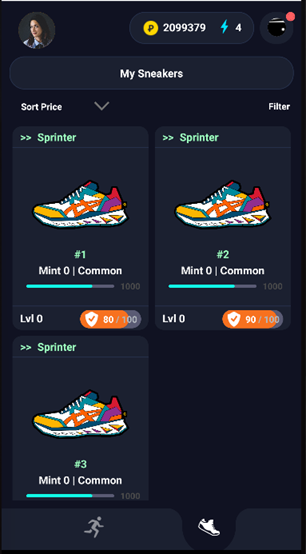 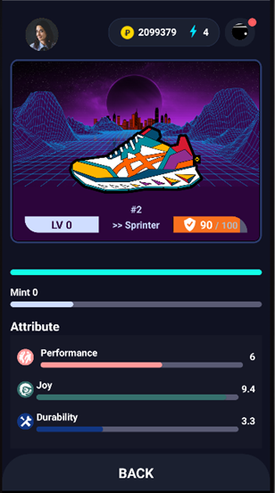

### Quản lý ví ảo

  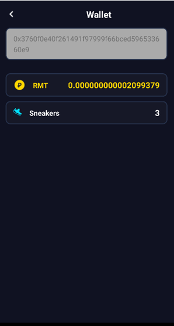

### Quản lý hồ sơ

  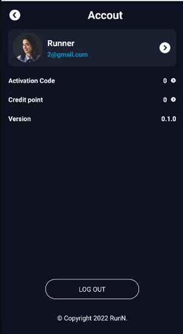   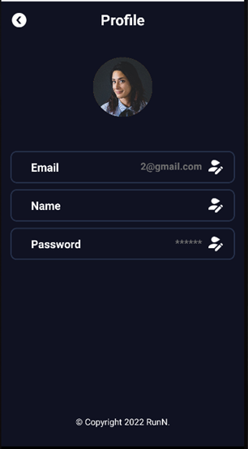   

### Hoạt động chạy kiếm tiền

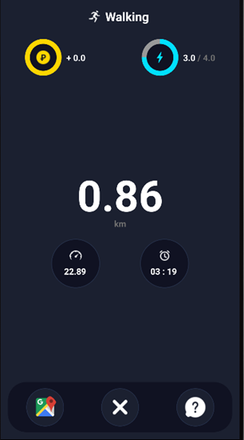 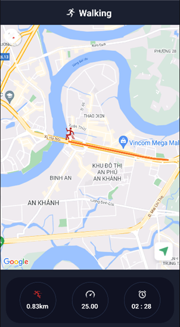 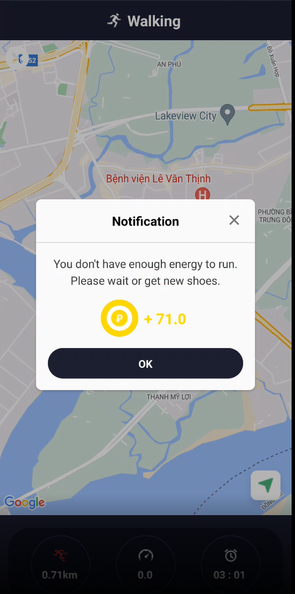

## Yêu cầu thiết bị

- Android:
  - Minimum SDK version: 20
  - Target SDK version: 30
- iOS: version 8.0

## Thư viện và công nghệ

- Ngôn ngữ: [Javascript]
- Framework: [React Native]
- Backend: Nodejs, SmartContracts
- Blockchain, Ethereum, ERC-20, NFT.

## Tác giả

- Đinh Việt Hào - 19521475@gm.uit.edu.vn (Mobile, Server)
- Nguyễn Cao Cường - 19521298@gm.uit.edu.vn (Web, SmartContracts)

## Giấy phép

    Copyright 2022

    Licensed under the Apache License, Version 2.0 (the "License");
    you may not use this file except in compliance with the License.
    You may obtain a copy of the License at

        http://www.apache.org/licenses/LICENSE-2.0

    Unless required by applicable law or agreed to in writing, software
    distributed under the License is distributed on an "AS IS" BASIS,
    WITHOUT WARRANTIES OR CONDITIONS OF ANY KIND, either express or implied.
    See the License for the specific language governing permissions and
    limitations under the License.
